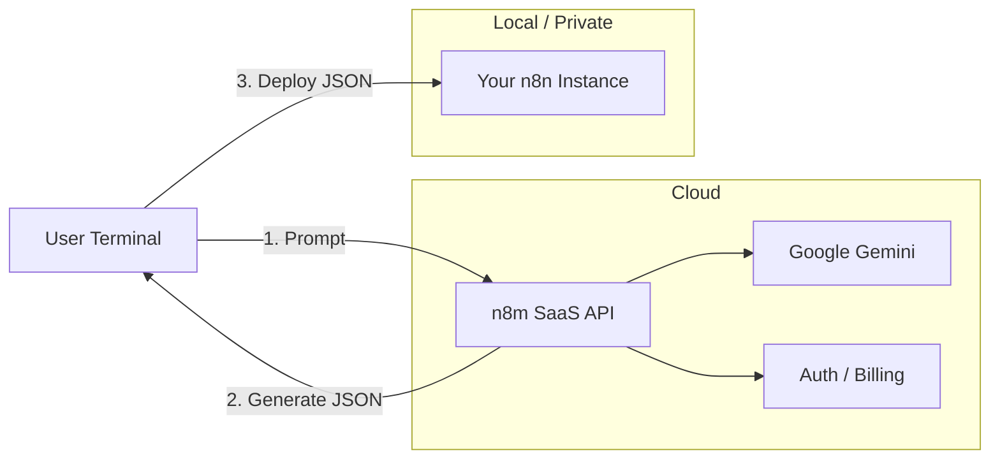

# n8m - Agentic n8n SaaS Platform

> **The AI-Powered Workflow Generator**: Create n8n workflows with natural
> language, managed by an intelligent SaaS brain, deployed to your own
> infrastructure.

[](https://typescriptlang.org/)
[](https://oclif.io/)
[](https://n8n.io)

## Overview

`n8m` is a hybrid SaaS platform that bridges the gap between **AI Generation**
and **Local Execution**.

- **Cloud Brain**: Uses our SaaS API (powered by Gemini) to generate complex
  workflow JSON from your prompts.
- **Local Control**: Your n8n credentials stay with you. The CLI deploys
  generated workflows directly to your private n8n instance.

## ✨ Features

- **🗣️ Natural Language Generation**: Just describe what you want ("A workflow
  that syncs Stripe to Sheets").
- **🔐 Private Deployment**: Keep your n8n API keys local. We don't see them.
- **💳 Usage-Based Billing**: Pay only for what you generate (1 Credit per
  generation).
- **🎨 Premium Design**: Built with a "Cyber-Dark" aesthetic (see
  `design-tokens.json`).

---

## 🚀 Getting Started

### 1. Installation

```bash
npm install -g n8m
```

### 2. Login (SaaS Auth)

Authenticate with the n8m cloud to enable AI generation.

```bash
n8m login
```

- Opens your browser to authenticate.
- Saves a secure API Key to `~/.n8m/config.json`.

### 3. Configure Your n8n (Local Auth)

Tell the CLI where to deploy your workflows.

```bash
n8m config --n8n-url http://localhost:5678/api/v1 --n8n-key <your-n8n-api-key>
```

- Supports local instances, n8n Cloud, or self-hosted servers.

### 4. Create & Deploy

Generate a workflow and deploy it instantly.

```bash
n8m create "Weekly report generator that emails PDF summaries" --deploy
```

### 5. Check Balance

Monitor your generation credits.

```bash
n8m balance
```

---

## 🏗️ Architecture

### Hybrid Model (BYO-n8n)



### Directory Structure

```
n8m/
├── src/
│   ├── commands/     # CLI Commands (oclif)
│   │   ├── create.ts # Call SaaS -> Deploy Local
│   │   ├── login.ts  # Browser-based Auth Flow
│   │   └── config.ts # Local Credential Manager
│   ├── server/       # SaaS API (Fastify)
│   └── services/     # Core Logic (AI, DB)
├── schema.sql        # Supabase Database Schema
├── design-tokens.json# UI/UX Design System
├── DEPLOYMENT.md     # Production Hosting Guide
└── .agent/skills/    # Antigravity Skills
```

---

## 🛠️ For Developers

Want to host the SaaS backend yourself?

1. **Clone & Install**:
   ```bash
   git clone https://github.com/your-username/n8m.git
   cd n8m
   npm install
   ```

2. **Environment Setup**: Copy `.env.example` to `.env` and fill in your keys
   (Gemini, Supabase, n8n).

3. **Run Locally** (Recommended): Run the API Server and CLI Compiler in
   parallel with hot-reloading:
   ```bash
   npm run dev
   ```

   Or run them separately:
   ```bash
   # Terminal 1: API Server
   npm run watch:server

   # Terminal 2: CLI Compiler
   npm run watch:cli
   ```

   Then usage:
   ```bash
   npm run n8m -- login
   ```

   **Background Server (Daemon)**: You can also run the server in the background
   using PM2:
   ```bash
   npm run server:start   # Start background server
   npm run server:logs    # View logs
   npm run server:status  # Check status
   npm run server:stop    # Stop server
   ```

See [DEPLOYMENT.md](./DEPLOYMENT.md) for full production hosting instructions
(Railway + Supabase).

---

## 📚 Documentation

- **[Deployment Guide](./DEPLOYMENT.md)** - How to host the API and n8n.
- **[Design Tokens](./design-tokens.json)** - The visual language of the
  platform.

## License

MIT
