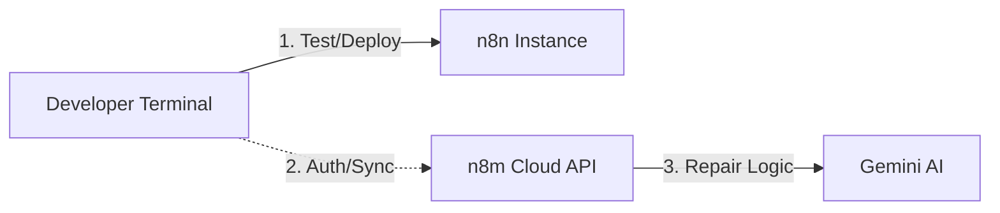

# n8m: The Agentic CLI for n8n

> **Professional Tooling for n8n Developers.** Bring CI/CD, Integration Testing,
> and GitOps to your low-code workflows.

[](https://typescriptlang.org/)
[](https://oclif.io/)
[](https://n8n.io)

**Stop clicking. Start shipping.** You love n8n for its node-based power, but
managing deployments and testing manually is a pain. `n8m` bridges the gap. It
provides a command-line interface to **test**, **manage**, and **deploy** your
workflows, treating them like first-class code.

---

## ⚡ Why n8m?

### 🧪 Headless Integration Testing

Finally, run your workflows as automated test suites. `n8m test` spins up an
**ephemeral environment**, injects your mock data, runs the flow, and validates
the output—all without opening a browser.

- **Global Self-Repair Loop**: `n8m` targets both structural staging errors
  (hallucinated nodes) and logical execution failures (zero items produced). It
  uses AI to analyze failures and patch your workflows automatically.
- **CI/CD Ready**: Fail your build if the workflow breaks logic or schema.
- **Ephemeral**: Zero cleanup required. Temporary assets are purged
  automatically.

### 🚀 Agentic Workflow Creation

Describe your idea, and `n8m` builds the blueprint and the JSON for you.

- **Automatic Naming & Linking**: Handles parent/child workflow linking and
  descriptive naming out-of-the-box.
- **Human-in-the-Loop**: Review the AI's blueprint before it starts building.

---

## 🛠️ Installation

```bash
npm install -g n8m
```

## 🚀 Quick Start

### 1. Authenticate & Configure

Connect to the eco-system and configure your local n8n target.

```bash
# Login to n8m services
n8m login

# Link your local/remote n8n instance
n8m config --n8n-url https://n8n.your-company.com --n8n-key <your-api-key>
```

### 2. Create from Idea

Generate a complete system of workflows from a simple description.

```bash
n8m create "RSS feed to Slack with a sub-workflow for message formatting"
```

### 3. Test & Auto-Repair

Validate local files or existing workflows with the deep repair loop.

```bash
n8m test ./workflows/my-flow.json
```

---

## 🏗️ Architecture

`n8m` is designed as a secure bridge.



- **Local First**: Deployment and Testing communicate directly with your n8n
  instance.
- **AI Augmented**: Self-healing patches are powered by industry-leading LLMs
  integrated into the test runner.

---

## 🗺️ Roadmap

### 📦 Latest Releases

- [x] **Global Self-Repair**: Automated recovery for both staging and logical
      failures.
- [x] **Agentic Creator**: Multi-workflow generation with automatic linking.
- [x] **Universal Selection**: Fuzzy search for workflows on your instance or
      local files.

### ⚡ Coming Soon: The "Edit" Loop

- [ ] **Modify Existing**: Soon you'll be able to download an existing workflow,
      provide an AI prompt to "Modify the Slack node to use a different
      channel", verify it with a test, and upload the fix back—all in one
      command.

---

## 💻 Local Development

Want to hack on the CLI itself?

```bash
# Clone & Install
git clone https://github.com/lcanady/n8m.git
cd n8m
npm install

# Run Locally
npm run dev

# Execute via local bin
./bin/run.js help
```
