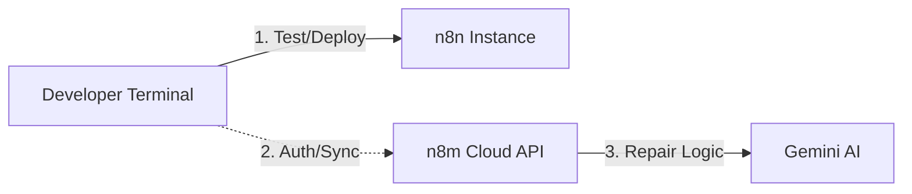

# n8m: The Agentic CLI for n8n

> **Professional Tooling for n8n Developers.** Bring CI/CD, Integration Testing,
> and GitOps to your low-code workflows.

[](https://typescriptlang.org/)
[](https://oclif.io/)
[](https://n8n.io)

**Stop clicking. Start shipping.** You love n8n for its node-based power, but
managing deployments and testing manually is a pain. `n8m` bridges the gap. It
provides a command-line interface to **test**, **manage**, and **deploy** your
workflows, treating them like first-class code.

---

## ⚡ Why n8m?

### 🧪 Headless Integration Testing

Finally, run your workflows as automated test suites. `n8m test` spins up an
**ephemeral environment**, injects your mock data, runs the flow, and validatess
the output—all without opening a browser.

- **AI-Driven Self-Repair**: If a test fails, `n8m` uses Google Gemini to
  analyze the failure and propose a logic patch.
- **CI/CD Ready**: Fail your build if the workflow breaks.
- **Ephemeral**: Zero cleanup required. Temporary assets are purged
  automatically.

### 🚀 Smart Deployment & "Human-in-the-Loop"

Treat your workflows like code. `n8m` ensures that what you deploy is actually
verified.

- **Interactive Verification**: After a successful test, it prompts:
  `Deploy to instance? (Y/n)`.
- **Shim Stripping**: Automatically removes test-specific shims (webhooks,
  flattener nodes) before saving or deploying.
- **Robust Auto-Fix**: Automatically handles activation errors by deactivating
  sub-workflows on-the-fly during deployment.

---

## 🛠️ Installation

```bash
npm install -g n8m
```

## 🚀 Quick Start

### 1. Authenticate & Configure

Connect to the eco-system and configure your local n8n target.

```bash
# Login to n8m services
n8m login

# Link your local/remote n8n instance
n8m config --n8n-url https://n8n.your-company.com --n8n-key <your-api-key>
```

### 2. Test & Auto-Repair

Validate a local workflow file or a remote workflow.

```bash
# Interactive test with AI self-repair
n8m test
```

### 3. Deploy to Production

Push a local file to your active instance.

```bash
n8m deploy ./workflows/seo-report.json --activate
```

### 4. Manage Account

Check your service status.

```bash
n8m balance
```

---

## 🏗️ Architecture

`n8m` is designed as a secure bridge.



- **Local First**: Deployment and Testing communicate directly with your n8n
  instance.
- **AI Augmented**: Self-healing patches are powered by industry-leading LLMs
  integrated into the test runner.

---

## 🗺️ Roadmap

- [x] **Headless Testing**: Run workflows as tests.
- [x] **AI Self-Repair**: Automated logic patching for failing nodes.
- [x] **Interactive Flow**: Human-in-the-loop Deploy vs Save logic.
- [x] **Smart Deployment**: CLI-based workflow pushing with activation fallback.
- [ ] **AI Workflow Generation**: Describe expectations, get JSON
      (`n8m create`).
- [ ] **Multi-Instance Sync**: Sync flows between Dev and Prod.

---

## 💻 Local Development

Want to hack on the CLI itself?

```bash
# Clone & Install
git clone https://github.com/lcanady/n8m.git
cd n8m
npm install

# Run Locally
npm run dev

# Execute via local bin
./bin/run.js help
```
