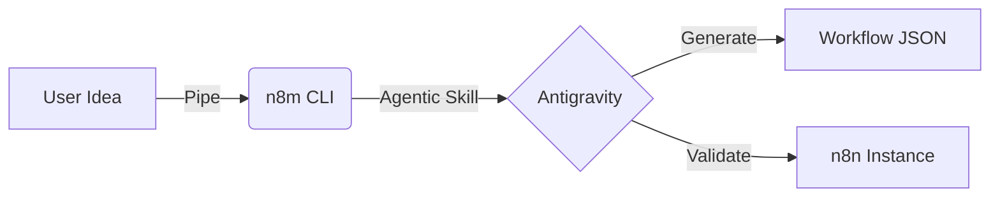

# n8m Usage Guide

> **Agentic Automation**: Pipe your ideas directly into n8n workflows.

## 🔑 Setup

n8m now uses an API-First architecture powered by Google Gemini.

1. **Get a Gemini API Key**: [Get one here](https://ai.google.dev/)
2. **Configure Environment**:
   ```bash
   cp .env.example .env
   # Edit .env and paste your GEMINI_API_KEY
   ```
3. **Start the API Server**:
   ```bash
   npm run start:server
   ```

## 🚀 Quick Start (Client)

Once the server is running (`localhost:3000`), you can use the CLI:

```bash
# Interactive mode
n8m create "Monitor my crypto wallet and alert me on Telegram"

# Pipe mode (Unix style)
echo "Scrape reddit for AI news" | n8m create
```

## ⚡️ Advanced Workflows

### 1. From Text File to Workflow

Turn your scratchpad ideas into deployable automation.

```bash
cat idea.txt | n8m create --deploy
```

### 2. From Another AI Agent

Chain `n8m` with other CLI AI tools.

```bash
# Example: Use LLM to refine prompt, then pipe to n8m
llm "Refine this request for n8n: bank alert" | n8m create
```

### 3. Self-Healing Test Loop

Run tests until they pass, with up to 5 auto-fix attempts.

```bash
n8m test workflows/finance-bot.json --max-attempts 5 --verbose
```

## 🛠 Command Reference

| Command  | Description                             | Key Flags                      |
| :------- | :-------------------------------------- | :----------------------------- |
| `create` | Generate workflow from natural language | `--deploy`, `--blueprint`      |
| `test`   | Run with self-healing loop              | `--max-attempts`, `--headless` |
| `deploy` | Push to n8n instance                    | `--instance`, `--activate`     |

## 🎨 Visualization


